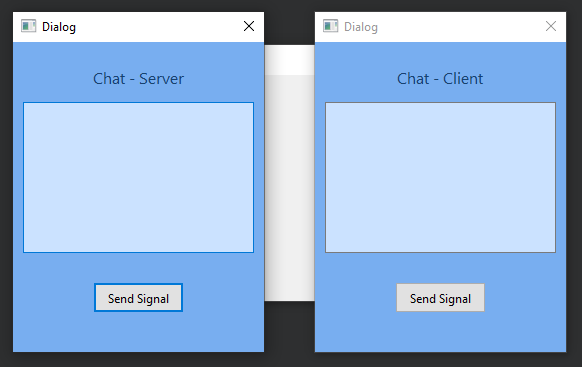
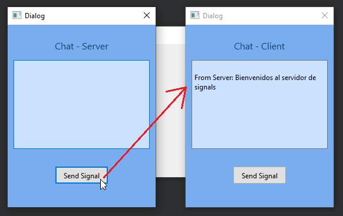
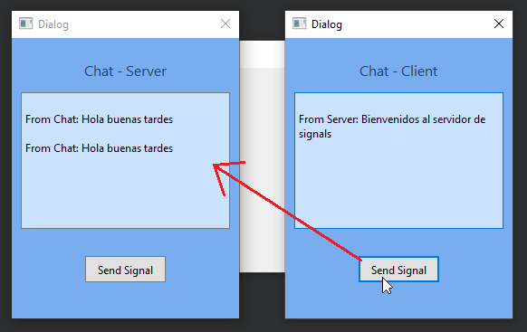

# Ejemplo de uso - Signals y Slots en c++ y Qt Creator

Asignatura: Laboratorio de Tecnología de Objetos

Integrantes:
 - Blanco Trujillo, Antony Jacob
 - Chambilla Perca, Valentina Milagros
 - Tejada Lazo, Jordy Rolando
 - Yare Chulunquia, Kevin Pedro

## Sources
El código realizado se encuentra en el directorio [./src/](./src) del repositorio

## Download
El programa compilado como un binario se puede descargar mediante el siguiente enlace referente al presente repositorio:
 - :file_folder: [./binaries/SignalSlotProy.zip](https://raw.githubusercontent.com/AntonyBlanco/ExampleSignalSlotProy/main/binaries/SignalSlotProy.zip)

El ejecutable no puede ejecutarse por si solo, requiere dependencias de archivos tipo .dll pertenecientes a Qt, es por ello que guiados por la [página oficial de Qt](https://doc.qt.io/qt-5/windows-deployment.html#the-windows-deployment-tool) se realizó una búsqueda automática de dependencias con el programa windeploy.exe y posteriormente comprimido en formato ZIP.

## Explicación

Se hace uso de Signals y Slots en las clases ChatWidget y ServerWidget, esto permite la comunicación entre distintas ventanas tipo QWidget creadas desde Qt Creator.

La conexión se realiza desde la clase mainwindow.cpp con la función connect() que recibe los objetos, la señal a enviar y el slot que va a recibir.

## Ejecución

>En un chat común deberíamos tener en nuestro historial de chat no solo los mensajes de quienes recibimos las señales, sino tambien los mensajes que nosotros enviamos, sin embargo para mostrar la aplicación de señales solo se imprime el mensaje en la ventana del receptor.

Al ejecutar el proyecto tenemos la siguiente interfaz:
 - Chat Server: Es una ventana que muestra un título para identificar el tipo de objeto que se está representando, indicando que se trata de un servidor.
 - Chat Cleitn: Es una ventana que muestra un título para identificar el tipo de objeto que se está representando, indicando que se trata de un cliente.
 
>En ambos casos se posee un cuadro donde recibiremos el texto de entrada por el envio de señales, y en la parte inferior un botón que será utilizado para enviar dichas señales a la ventana de la contraparte.

Luego, al presionnar uno de los botones (en este caso del servidor), se enviará una señal con el contenido "From Server: Bienvenidos al servidor de signals" hacia el Chat Client

De manera similar se puede realizar esto desde la ventana Chat Client, desde la cual se presionó 2 veces el botón y por ende se envía dos veces la señal con el mensaje "From Chat: Hola buenas tardes"

